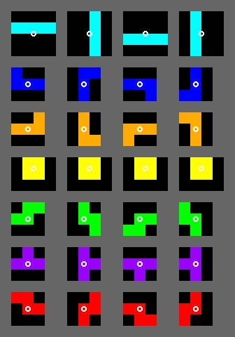

# Tetris
Tetris (Тетрис) is a tile-matching video game created by Russian software engineer
Alexey Pajitnov in 1984. This is my implementation to 

## Shape
There are 7 Shapes, I, J, L, O, S, T, Z, all having seven rotations (excluding O, who has one).

## Row
Te basic building block is a Row. It is a `struct` wrapping a `ushort` containing
all methods needed to test, move and merge rows.

## Block
A block represents a shape with a rotation with both a position on the rows, as an offset,
defined from the bottom of the field. Based on the rotation system, it knows all neighbor
blocks: Down, Right, Left, TurnRight and TurnLeft. If those neighbors are not available
their value is `null`.

## Field
A field contains (filled) rows, and methods to test if a block fits, and to merge the block
to get a new field after the move (of the block) has been done.

## Move generator
The move generator gives all possible move candidates that describe both the steps to get
the block that fits as the block itself.

## Random generator
As a too long sequence of S and Z shapes will - even with perfect play - result
in a holes that can not be filled, the random generator should return a bag of
7 unique shapes.
